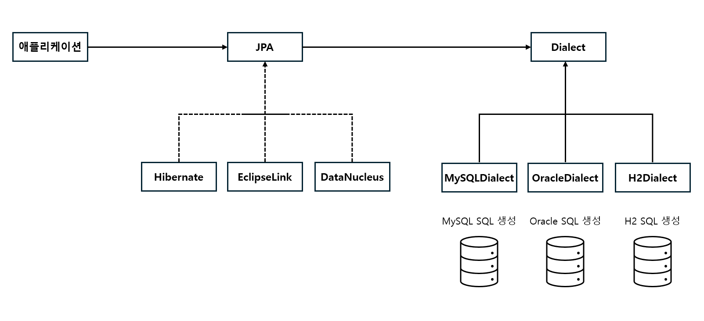

### JPA의 등장 배경

과거에는 자바 어플리케이션에서 JDBC API를 사용하여 SQL문을 직접 사용하였다. 즉 자바 코드에 SQL문이 들어가 있다. 이러한 경우에 개발을 진행할 때 많은 단점들이 발생한다.

1. 반복적인 코드와 유지보수 어려움
   
   CRUD 작업을 수행할 때마다 SQL를 계속 수동으로 작성해야한다. 코드의 중복성이 올라가게되고 유지보수에 어려움이 생긴다. 그리고 데이터 베이스의 스키마가 변경될 때 모든 SQL문을 수정해야하는데 이 때 누락될 위험이 있다.

2. 객체-관계 변환의 어려움 (패러다임의 불일치)
   
   자바는 객체 지향 언어이고 객체를 참조하는 것으로 연결이 된다. 관계형 데이터 베이스는 참조라는 개념이 없고 외래키를 통해 테이블 간의 관계를 표현한다. 이렇듯 자바와 RDB는 데이터를 표현하고 관리하는 방식이 다르다. 이를 패러다임의 불일치라고 한다.

   패러다임의 불일치로 인해 객체들을 관계형으로 관계형을 객체들로 변화하고 관리하는 것이 어렵고 다 수동으로 작업을 진행해야한다. 이러한 매핑작업을 수동으로 하기떄문에 오류가 발생할 가능성이 올라간다.

   또한, 자바에서 SQL문을 작성을 하기떄문에 컴파일 시점에서 SQL문이 잘못된 것인지 확인할 수 없고 런타임 시에만 확인할 수 있다는 단점도 존재한다.

결론적으로 객체 모델과 관계형 데이터 베이스 모델은 각자 지향하는 패러다임이 서로 다르다. 이러한 차이를 극복하기 위해서는 개발자가 너무 많은 시간을 소비해야한다.

### JPA란?

JPA(JAVA Persistence API)는 자바 진영의 ORM(Object-Relational Mapping) 기술 표준이다. 표준이라는 것은 명세서나 설계도로 이해를 해도 좋을 것 같다. 즉 자바 애플리케이션에서 객체와 관계형 데이터베이스 간의 데이터 관리를 어떻게 처리할지에 대한 기준과 약속을 정의한 것이다. 

개발자는 비즈니스 로직을 구현하기도 바쁘다. JPA를 사용하여 객체와 관계형 모델의 매핑작업을 자동화할 수 있는 것으로 생각해도 좋을 거 같다.

JPA는 기술 표준(약속)일 뿐이다. 실제로 동작을 하도록 로직을 구현해야한다. 예를 들어 데이터를 조회하는 약속이 있으면 데이터를 조회하고 객체와 관계를 매핑을 실제로 해주는 구현체가 존재해야한다. 많은 구현체들이 있지만 그중에 하이버네이트 프레임워크를 가장 많이 사용한다.

애플리케이션에서는 하이버네이트 구현체를 바로 사용하지않고 JPA를 사용한다. 인터페이스를 통해서 다형성 특성을 활용하는 것인데 특정 구현체와 의존성을 없애고 자바의 코드를 수정하지 않고 다른 구현체들을 사용할 수 있다는 장점이 있다.

**벤더 독립성**

*벤더는 회사라고 생각하면 쉽다.* 

데이터 베이스 관리 시스템(DBMS)은 다양하다. MySQL, Oracle 등 여러 회사들의 DBMS가 있다. 기본적으로 모든 벤더가 SQL를 사용하지만 자신만의 확장 기능이나 고유한 기능들이 더 추가되어 있다. 따라서 ORM 프레임 워크에서는 Dialect를 사용해 각 DBMS에 맞는 SQL을 생성하도록 도와준다. 

전체적인 흐름을 도식화하면 위 사진과 같을 것 같다. 자바 애플리케이션(스프링)에서 관계형 데이터베이스를 사용하는 경우 JPA를 통해 **패러다임 불일치**를 해결하고 **Dialect**을 사용하여 벤더들과 독립성을 유지할 수 있다.

개발자는 JPA를 사용하여 중복 코드를 작성할 필요가 없게 되었고, 조금 더 비즈니스 로직에 집중할 수 있게 되었다. 생산성이 높아졌으며 JPA 표준 인터페이스를 사용하여 의존성을 낮추고 유지보수에 더욱 편리해졌다.