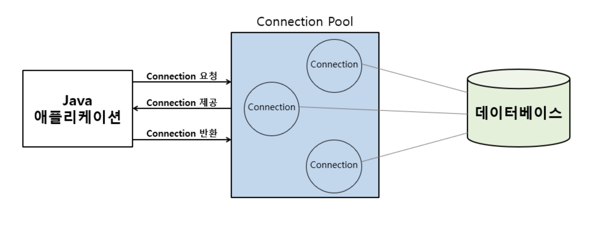

### JPA 구성

책에서는 스프링 부트를 사용하지 않기 때문에 **persistence.xml** 파일을 작성하여 엔티티 매니저 팩토리를 생성한다.

그러나 스프링 부트를 사용하면 더욱 손쉽게 JPA를 구성할 수 있다.

```properties
spring.datasource.url=jdbc:mysql://localhost:3306/mydb
spring.datasource.username=myuser
spring.datasource.password=mypassword
spring.jpa.hibernate.ddl-auto=update
```

**properties** 파일에서 위와 같이 작성을 하면 엔티티 매니저 팩토리를 생성하기 위한 Datasource 등를 설정할 수 있다. Datasource는 인터페이스인데 데이터 베이스와 연결된 커넥션들이 모여 있는 커넥션 풀을 쉽게 사용할 수 있는 인터페이스이다.



스프링 부트는 Datasource와 다른 설정 정보를 참조하여 엔티티 매니저 팩토리를 자동으로 생성해주고 스프링 컨테이너에 스프링 빈으로 등록해준다.

### 객체 매핑

JPA는 객체와 테이블을 매핑을 해준다.

```java
@Entity
@Table(name = "MEMBER")
public class Member {

    @Id
    @Column(name="ID")
    private Long id;

    @Column(name="NAME")
    private String username;

    private int age;
}
```

JPA에게 어노테이션을 사용해서 매핑 정보를 알려줘야한다.

**@Entity**  
해당 클래스를 테이블과 매핑하겠다는 의미이고 이러한 클래스를 엔티티 클래스라고 한다.

**@Table**  
엔티티 클래스를 데이터 베이스의 어떤 테이블과 매핑할 지 알려주는 어노테이션이다. 위 예제는 MEMBER라는 이름의 테이블과 엔티티 클래스를 매핑하겠다는 의미이다. 해당 어노테이션은 생량이 가능한데 생략을 하게 되면 JPA가 엔티티 이름으로 매핑한다. 즉 member 테이블과 매핑한다.

**@Id**  
엔티티 클래스의 필드를 테이블의 Primary key에 매핑한다. 예제에서는 id 필드를 테이블의 ID 기본 키 컬럼에 매핑했다. 해당 어노테이션이 사용된 필드를 식별자 필드라고 한다.

**@Column**  
필드를 컬럼에 매핑한다. name 속성을 사용하여 테이블의 컬럼과 매핑시킬 수 있다. username필드를 NAME컬럼과 매핑했다.  
매핑 정보가 없는 필드가 있을 수 있다. 위 예제에서는 age인데 매핑 정보가 없을 경우 필드 이름으로 테이블 컬럼과 매핑을 한다. 즉 테이블의 age 컬럼과 매핑한다.

### JPQL

JPA는 JPQL(JAVA Persistence Query Language)라는 객체 쿼리 지향 언어를 제공해주어 개발자는 객체만 바라보고 쿼리를 작성할 수 있다. 개발자가 JPQL를 작성하면 JPA가 SQL로 변환하여 실제 데이터 베이스한테 쿼리를 날린다.

**JPQL**
```JAVA
String jpql = "SELECT m FROM Member m WHERE m.name = :name";

```
JPQL는 SQL과 거의 흡사하기 때문에 어렵지 않게 작성할 수 있다. 이렇게 작성한 JPQL를 JPA가 SQL로 변환해준다.

**JPA가 변환한 SQL**
```sql
SELECT m.id, m.name, m.age
FROM member m
WHERE m.name = ?
```

정리하자면
1. JPA는 객체와 테이블을 매핑해준다.
2. 객체 지향 쿼리를 SQL로 변환하여 쿼리를 날려준다.

<br>

**[참조]**
    
[커넥션 풀이란 (Connection Pool)
](https://shuu.tistory.com/130)